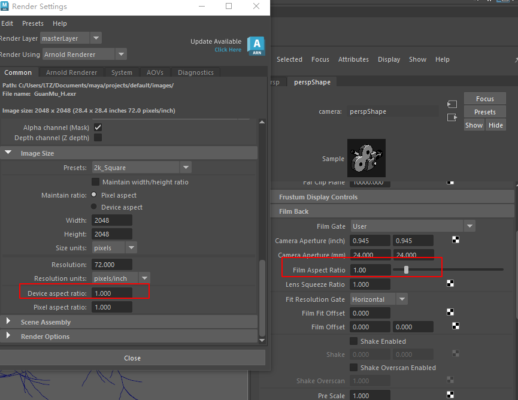

## Houdini 导出的 abc 进 Maya 无法赋予材质

从 Houdini 给回的 abc 文件带了多余的分组信息，Maya 导入时会默认转换为带空材质的 SG 节点分组，带着这些节点既无法使用已有的材质，也无法赋予新材质，需要将无效 SG 切断删除

[删除多余 SG 节点组](/docs/code/maya)

## Maya 导出的相机进 UE 无法匹配
原因：UE 没有相机视口遮挡  
解决：Maya 在导出与拍屏时一定要保证相机的长宽比与渲染设置里是一样的
